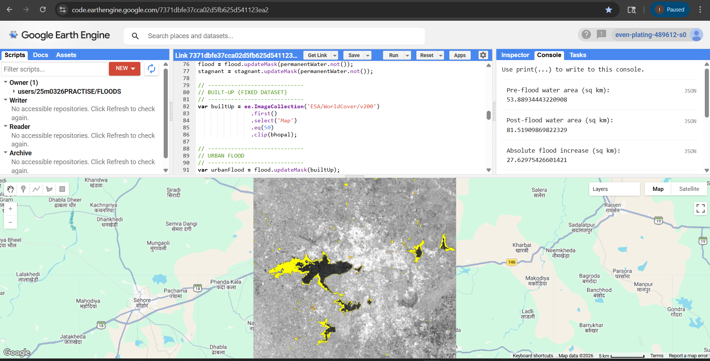

# GNR899: Flood Mapping using Cloud Computing and Remote Sensing

## 📖 Project Overview
This project represents the GNR899 Credit Seminar focused on modernizing disaster management through geospatial technologies. Developed by Ishpreet Singh (25M0326) under the supervision of Prof. Y.S. Rao at the Centre of Studies in Resources Engineering (CSRE), Indian Institute of Technology (IIT) Bombay, this research addresses the critical need for timely and accurate flood assessment.

Traditional ground-based flood monitoring is often slow, impractical for large-scale disasters, and heavily limited by cloud cover during intense rainfall. By leveraging Synthetic Aperture Radar (SAR) imagery and the cloud-processing capabilities of Google Earth Engine (GEE), this project establishes a robust workflow for automated, near real-time flood extent mapping.

---

## 🎯 Objectives
*   To understand the core principles of mapping floods utilizing remote sensing and cloud computing infrastructures.
*   To assess the accuracy, efficiency, and overall effectiveness of SAR-based flood mapping methodologies.
*   To effectively utilize Sentinel-1 SAR data for the identification and mapping of flood-affected regions.
*   To deploy flood detection workflows within Google Earth Engine (GEE) for large-scale geospatial analysis.
*   To showcase how cloud computing directly supports disaster management and critical decision-making.

---

---
## 🛠️ Tools & Technologies
*   **Satellite Imagery:** Sentinel-1 SAR (specifically VV Polarization for strong land/water contrast) and Landsat-8.
*   **Platforms:** Google Earth Engine (GEE) for rapid cloud-based geospatial processing.
*   **Software:** SNAP (Sentinel Application Platform) and QGIS.
*   **Auxiliary Data:** Digital Elevation Models (SRTM DEM) and Land Cover datasets (JRC Water Data, ESA WorldCover).

---

## 🗺️ Methodology Workflow

The flood mapping process is divided into robust pre-processing and detection phases:

### Part A: SAR Pre-processing
Raw SAR data undergoes several corrections to ensure accurate backscatter analysis:
1.  **Speckle Noise Reduction:** Application of focal mean and Lee filtering to minimize inherent granular noise and improve image clarity.
2.  **Radiometric Calibration:** Conversion of raw data into standardized backscatter values ($\sigma^\circ$) to guarantee consistency across different dates.
3.  **Terrain (Geometric) Correction:** Correction of side-looking radar distortions using SRTM DEM to properly align imagery with geographic coordinates.
4.  **Border Noise Removal:** Elimination of edge noise caused by acquisition geometry to reduce misclassification.

### Part B: Flood Detection (Change Detection Method)
Newly inundated areas are identified by comparing pre-flood and post-flood reference images. Log ratios are calculated from the backscatter variations, and specific thresholds are applied to isolate floodwaters. 
*   **Thresholding Techniques Evaluated:** Manual Thresholding, Otsu Method (effective for bimodal histograms), Kittler-Illingworth (KI) Method, and Split-Based Thresholding (local thresholding for spatial heterogeneity).

---
---
### 👩‍💻 Author
**Ishpreet Singh**

M.Tech
Indian Institute of Technology Bombay
Mail ID:
25m0326@iitb.ac.in
---
## 📊 Hydrological Case Studies

The methodology was applied to two distinct flood scenarios, adapting backscatter thresholds to account for variations in surface roughness and flood dynamics. 

| Parameter | Case Study 1: Bhopal Flood (2022) | Case Study 2: Punjab Flood (2025) |
| :--- | :--- | :--- |
| **Flood Type** | Urban Flood | Riverine Flood |
| **Primary Cause** | Intense rainfall and overflow of Upper & Lower Lakes | Overflow of Sutlej and Beas rivers due to heavy monsoon rains |
| **Geographical Setting** | Densely populated city with impervious surfaces | Extensive agricultural plains |
| **Water Behavior** | Stagnant water due to inefficient drainage systems | Continuous flow following natural drainage patterns |
| **Applied Threshold** | -14 dB (Higher threshold due to urban backscatter) | -15 dB (Stricter threshold for smooth open floodplains) |
| **Pre-Flood Area** | 81.52 sq km | 166.50 sq km |
| **Post-Flood Area** | 53.89 sq km | 128.90 sq km |

---

## 💡 Key Conclusions
*   SAR-based remote sensing is highly effective for flood mapping because it operates independently of weather conditions and cloud cover.
*   Google Earth Engine (GEE) eliminates the need for high-end local computational hardware, allowing for large-scale automated processing.
*   Urban areas require different thresholding parameters than riverine environments due to the complex backscatter caused by buildings and roads.
